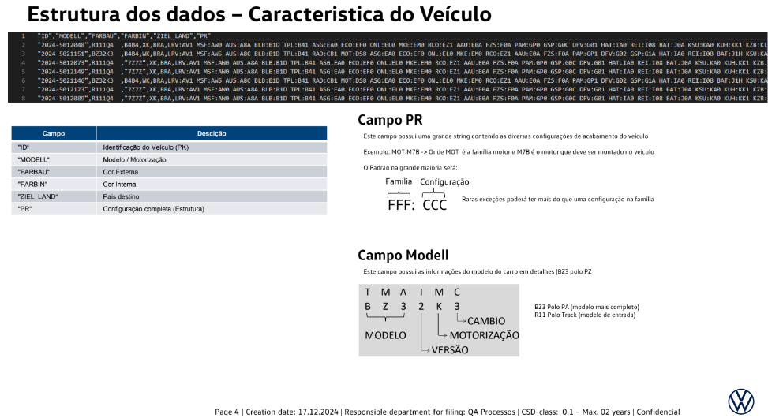
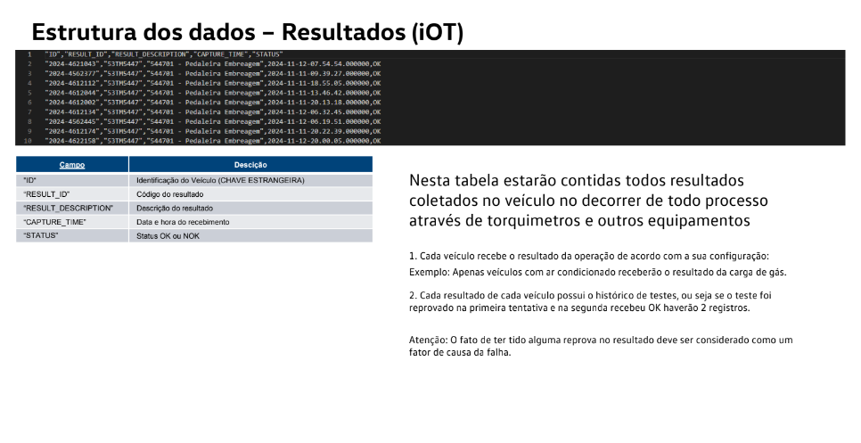
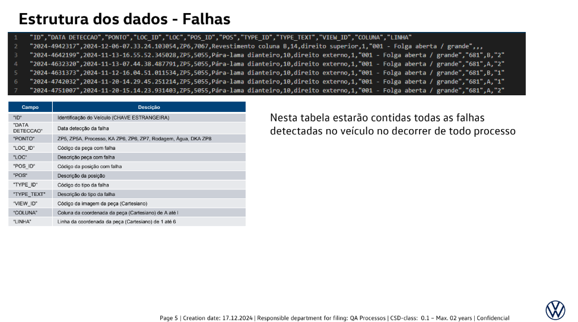

```{r setup, include=FALSE}
library(tidyverse)
library(ggplot2)
library(FactoMineR)
library(factoextra)
library(reshape2)
library(vcd)
```

# Carregamento e Preparação dos Dados

## Carregamento dos Dados

```{r}
InteliStatus <- read_csv("../../../../../../datasources-project/InteliStatus.csv")
InteliVeiculo <- read_csv("../../../../../../datasources-project/InteliVeiculo.csv")
InteliResultados <- read_csv("../../../../../../datasources-project/InteliResultados.csv")
InteliFalhas <- read_csv("../../../../../../datasources-project/InteliFalhas.csv")
Inteli5Merges <- read.csv2("../../../../../../datasources-project/5-ids.csv", stringsAsFactors = FALSE)
```

## Visualização das primeiras Linhas

```{r}
head(InteliStatus)
head(InteliVeiculo)
head(InteliResultados)
head(InteliFalhas)
head(Inteli5Merges)
```

## Verificação da estrutura dos Dados

```{r}
str(InteliStatus)
str(InteliVeiculo)
str(InteliResultados)
str(InteliFalhas)
str(Inteli5Merges)
```

# Resumo Estatístico e Descrição dos Dados

## Resumo estatístico

```{r}
cat("\n\n\n===== Inteli Status =====\n\n\n")
summary(InteliStatus)

cat("\n\n\n===== Inteli Veiculo =====\n\n\n")
summary(InteliVeiculo)

cat("\n\n\n===== Inteli Resultados =====\n\n\n")
summary(InteliResultados)

cat("\n\n\n===== Inteli Falhas =====\n\n\n")
summary(InteliFalhas)

cat("\n\n\n===== Inteli 5 Merges =====\n\n\n")
summary(Inteli5Merges)
```

## Ajuste do Dataset

```{r}
InteliStatus <- InteliStatus %>%
  mutate(
    ID = as.character(ID),
    STATUS = as.factor(STATUS),
    STATUS_DATA = as.POSIXct(STATUS_DATA, format="%Y-%m-%d-%H.%M.%S", tz="UTC")
)

InteliVeiculo <- InteliVeiculo %>%
  mutate(
    ID = as.character(ID),
    MODELL = as.factor(MODELL),
    FARBAU = as.factor(FARBAU),
    FARBIN = as.factor(FARBIN),
    ZIEL_LAND = as.factor(ZIEL_LAND),
    PR = as.character(PR)
)

InteliResultados <- InteliResultados %>%
  mutate(
    ID = as.character(ID),
    RESULT_ID = as.factor(RESULT_ID),
    RESULT_DESCRIPTION = as.character(RESULT_DESCRIPTION),
    CAPTURE_TIME = as.POSIXct(CAPTURE_TIME, format="%Y-%m-%d-%H.%M.%S", tz="UTC"),
    STATUS = as.factor(STATUS)
)


InteliFalhas <- InteliFalhas %>%
  mutate(
    ID = as.character(ID),
    `DATA DETECCAO` = as.POSIXct(`DATA DETECCAO`, format="%Y-%m-%d-%H.%M.%S", tz="UTC"),
    PONTO=as.factor(PONTO),
    LOC_ID=as.factor(LOC_ID),
    LOC=as.factor(LOC),
    POS_ID=as.factor(POS_ID),
    POS=as.factor(POS),
    TYPE_ID=as.factor(TYPE_ID),
    TYPE_TEXT=as.factor(TYPE_TEXT),
    VIEW_ID=as.factor(VIEW_ID),
    COLUNA=as.factor(COLUNA),
    LINHA=as.factor(LINHA)
)

Inteli5Merges <- Inteli5Merges %>%
    mutate(
      ID = as.character((ID)),
      
      INTELI_STATUS_STATUS = as.factor(INTELI_STATUS_STATUS),
      INTELI_STATUS_STATUS_DATA = as.POSIXct(INTELI_STATUS_STATUS_DATA, format="%Y-%m-%d-%H.%M.%S", tz="UTC"),
    
      INTELI_VEICULO_MODELL = as.factor(INTELI_VEICULO_MODELL),
      INTELI_VEICULO_FARBAU = as.factor(INTELI_VEICULO_FARBAU),
      INTELI_VEICULO_FARBIN = as.factor(INTELI_VEICULO_FARBIN),
      INTELI_VEICULO_ZIEL_LAND = as.factor(INTELI_VEICULO_ZIEL_LAND),
      INTELI_VEICULO_PR = as.character(INTELI_VEICULO_PR),
    
      INTELI_RESULTADOS_RESULT_ID = as.factor(INTELI_RESULTADOS_RESULT_ID),
      INTELI_RESULTADOS_RESULT_DESCRIPTION = as.character(INTELI_RESULTADOS_RESULT_DESCRIPTION),
      INTELI_RESULTADOS_CAPTURE_TIME = as.POSIXct(INTELI_RESULTADOS_CAPTURE_TIME, format="%Y-%m-%d-%H.%M.%S", tz="UTC"),
      INTELI_RESULTADOS_STATUS = as.factor(INTELI_RESULTADOS_STATUS),
    
      INTELI_FALHAS_PONTO=as.factor(INTELI_FALHAS_PONTO),
      INTELI_FALHAS_LOC_ID=as.factor(INTELI_FALHAS_LOC_ID),
      INTELI_FALHAS_LOC=as.factor(INTELI_FALHAS_LOC),
      INTELI_FALHAS_POS=as.factor(INTELI_FALHAS_POS),
      INTELI_FALHAS_TYPE_ID=as.factor(INTELI_FALHAS_TYPE_ID),
      INTELI_FALHAS_TYPE_TEXT=as.factor(INTELI_FALHAS_TYPE_TEXT),
      INTELI_FALHAS_VIEW_ID=as.factor(INTELI_FALHAS_VIEW_ID),
      INTELI_FALHAS_COLUNA=as.factor(INTELI_FALHAS_COLUNA),
      INTELI_FALHAS_LINHA=as.factor(INTELI_FALHAS_LINHA)
    )

```

## Resumo estatístico corrigido

```{r}

cat("\n\n\n===== Inteli Status =====\n\n\n")
summary(InteliStatus)

cat("\n\n\n===== Inteli Veiculo =====\n\n\n")
summary(InteliVeiculo)

cat("\n\n\n===== Inteli Resultados =====\n\n\n")
summary(InteliResultados)

cat("\n\n\n===== Inteli Falhas =====\n\n\n")
summary(InteliFalhas)

cat("\n\n\n===== Inteli 5 Merges =====\n\n\n")
summary(Inteli5Merges)
```

### União de Datasets

Para fazer uma análise geral, de como os dados se unem entre si, foi identificada que a coluna ID presente em todos os datasets são correlacionáveis. Portanto, usando o google colab com recursos computacionais de nuvem, foram unidos os 5 ids que mais aparecem nos dados e que possuem registros em todas as tabelas, sendo o dataset **Inteli5Merges**

## Descrição das variáveis

-   **InteliStatus**: Contém informações sobre os status gerados pelas etapas de montagem.


-   **InteliVeiculo**: Informações sobre os veículos como código geral da montadora.



-   **InteliResultados**: Resultados de medições a partir de instrumentos de IOT.
-   
-   **InteliFalhas**: Registro de falhas identificadas durante as operações.
-   

### Inteli 5 Merges

Base criada através da união dos 5 IDs com mais registros em todas as tabelas. Feito para validar como os dados se relacionam e identificar correlações.

# Análise Univariada

## Visualização das distribuições

```{r}
create_plots <- function(data, table_name) {
  categorical_vars <- data %>%
    select(where(is.factor)) %>%
    colnames()
  
  for (var in categorical_vars) {
    p <- ggplot(data, aes_string(x = var)) +
      geom_bar() +
      theme_minimal() +
      labs(title = paste("Distribuição de", var, "na tabela", table_name),
           x = var, y = "Contagem")
    print(p)
  }
}
```

### Inteli Status

```{r}

create_plots(InteliStatus, "InteliStatus")
```

### Inteli Veiculo

```{r}
create_plots(InteliVeiculo, "InteliVeiculo")
```

### Inteli Resultados

```{r}
create_plots(InteliResultados, "InteliResultados")
```

### Inteli Falhas

```{r}
create_plots(InteliFalhas, "InteliFalhas")
```

### Inteli 5 Merges

```{r}
create_plots(Inteli5Merges, "Inteli5Merges")
```

## Identificação de outliers

```{r}
create_barplot <- function(data, table_name) {
  categorical_vars <- data %>%
    select(where(is.factor)) %>%
    colnames()
  
  for (var in categorical_vars) {
    # Contar a frequência de cada categoria
    counts <- data %>%
      count(.data[[var]], name = "frequency")
    
    p <- ggplot(counts, aes(x = reorder(.data[[var]], -frequency), y = frequency)) +
      geom_bar(stat = "identity", fill = "steelblue") +
      geom_text(aes(label = frequency), size = 3, angle = 90) +
      labs(
        title = paste("Distribuição de", var, "na tabela", table_name),
        x = var,
        y = "Frequência"
      ) +
      theme_minimal() +
      theme(axis.text.x = element_text(angle = 90, hjust = 1))  # Rotaciona labels se houver muitas categorias
    
    print(p)
  }
}
```

### Inteli Status

```{r}

create_barplot(InteliStatus, 'InteliStatus')
```

### Inteli Veiculos

```{r}
create_barplot(InteliVeiculo, "InteliVeiculo")
```

### Inteli Resultados

```{r}
create_barplot(InteliResultados, "InteliResultados")
```

### Inteli Falhas

```{r}
create_barplot(InteliFalhas, "InteliFalhas")
```

### Inteli 5 Merges

```{r}
create_barplot(Inteli5Merges, "Inteli5Merges")
```

# Análise Bivariada

```{r}
create_categorical_correlation_plot <- function(data, table_name) {
  categorical_vars <- data %>%
    select(where(is.factor))
  
  var_names <- colnames(categorical_vars)
  n <- length(var_names)
  
  correlation_matrix <- matrix(0, nrow = n, ncol = n, dimnames = list(var_names, var_names))
  
  for (i in 1:n) {
    for (j in 1:n) {
      if (i == j) {
        correlation_matrix[i, j] <- 1
      } else {
        contingency_table <- table(categorical_vars[[i]], categorical_vars[[j]])
        correlation_matrix[i, j] <- assocstats(contingency_table)$cramer
      }
    }
  }
  
  correlation_df <- as.data.frame(as.table(correlation_matrix)) %>%
    rename(Var1 = Var1, Var2 = Var2, value = Freq)

  p <- ggplot(correlation_df, aes(Var1, Var2, fill = value)) +
    geom_tile() +
    geom_text(aes(label = round(value, 2)), color = "black", size = 4) + 
    scale_fill_gradient2(low = "blue", mid = "white", high = "red", midpoint = 0.5, limits = c(0, 1)) +
    labs(
      title = paste("Correlação entre Variáveis Categóricas na Tabela", table_name),
      x = NULL,
      y = NULL,
      fill = "V de Cramer"
    ) +
    theme_minimal() +
    theme(axis.text.x = element_text(angle = 45, hjust = 1))
  
  print(p)
}
```

## Visualização de relações entre variáveis

### Inteli Status

```{r}
create_categorical_correlation_plot(InteliStatus, "InteliStatus")
```

### Inteli Veiculo

```{r}
create_categorical_correlation_plot(InteliVeiculo, "InteliVeiculo")
```

### Inteli Resultados

```{r}
create_categorical_correlation_plot(InteliResultados, "InteliResultados")
```

### Inteli Falhas

```{r}
create_categorical_correlation_plot(InteliFalhas, "InteliFalhas")
```

### Inteli 5 Merges

```{r}
create_categorical_correlation_plot(Inteli5Merges, "Inteli5Merges")
```

# Análise Multivariada

## Análise de Componentes Principais (PCA)

A análise de componentes principais (PCA) não é necessária nesse projeto, visto que não há features numéricas, sendo todas apenas categóricas ou descritivas.

# Conclusão e Discussão

## Sumário das Descobertas

-   Nem todos os Ids aparecem em todas as tabelas
-   A união dos dados gera um dataset gigantesco.
-   Todos os status são NOK
-   A base de veículos possui muitos dados de um modelo específico, e menos de outros

## Discussão sobre Limitações e Possíveis Melhorias

-   Melhorar balanceamento dos dados

-   Melhorar estratégia de união dos dados usada, sumarizando status para uma análise detalhada
